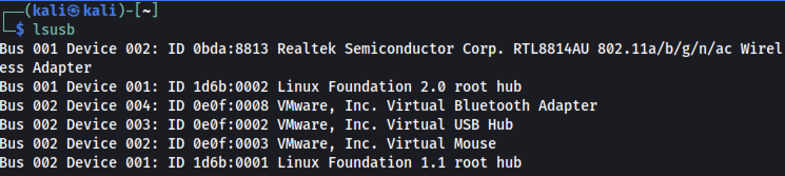

# Wireless Adventures

## Setup

Okay, first thing first; run `iwconfig` to see if the alpha card is recognised. Interesting thing is that Parot OS recognise these wireless cards usually out of the box. But Kali has so much issues with them. So, either pick up and use Parrot OS for Wireless or stick with Kali but prepare yourself with pain. Following process, I tested on Kali Rolling 2020.2.

### Broadcom Chipset

Some of the wireless adaptors are not known out of the box and we will need to install the appropriate chip set drivers. In case the chipset is a broadcom chipset following process should be able to rectify **most of** issues:

You can see your card manufacturer and version etc via: `lspci`

1. In the fist instance, I would say [have a visit on this page](https://wiki.debian.org/wl) and if anything has changed from below follow that page. But nothing much will hcange. It just has more information. Update the list of available packages. Install the relevant/latest linux-image, linux-headers and broadcom-sta-dkms packages; This will also install the recommended wireless-tools package. DKMS will build the wl module for your system.
  - `sudo apt-get update`
  - `sudo apt-get install linux-image-$(uname -r|sed 's,[^-]*-[^-]*-,,') linux-headers-$(uname -r|sed 's,[^-]*-[^-]*-,,') broadcom-sta-dkms -y`
2. (Optional) Check all the built DKMS kernel modules. There should be "wl.ko" in the list.
  - `find /lib/modules/$(uname -r)/updates`
3. Unload conflicting modules(usually in Debian distros these are blacklisted in the config):
  - `sudo modprobe -r b44 b43 b43legacy ssb brcmsmac bcma`
4. Load the wl module:
  - `sudo modprobe wl`
*Don't forget a `sudo reboot now`*

### Realtek Chipset

The normal alpha cards (2.4) come with usually a Broadcom chipset. So, they would work above. But some versions of Alpha card such as AWUS1900 which is a 802.11ac with a range of 5Ghz come with Realtech chipset. So, we must to the following:

1. Update package repo, upgrade all modules and upgrade the OS via
  - `sudo apt-get update`
  - `sudo apt-get upgrade -y`
  - `sudo apt-get dist-upgrade -y`
2. Then lets see the chipset that we have so we can find the driver version for our device that we need:
 - `lsusb`

 

3. Then you can run the following:
  - `sudo apt-get install realtek-rtl88xxau-dkms`
  or
  - `sudo apt-get install realtek-rtl8814au-dkms`
**Be aware that sometimes it hangs on 94% or so and takes a while. Just be patient, go have a HOTCHOCOLOTE and come baack**

4. Make sure you have **dkms** installed (should be there but just double check):
  - `sudo apt-get install dkms`
  1. Run a `sudo ifconfig` or `sudo iwconfig` to see if the wlan0 is really showing up; if not continue reading...
**Okay, after it finishes you are asking why it doesn't work? Just CAUSE...LoL**
5. Now, If the above don’t work then install the packets bellow. Apparently you need a specific RTL driver for it, which aircrack-ng peeps put it in their github page. So, depending on your RTL version you need to find yours. Mine was RTL8814au, so I cloned that particular repository (/opt/):
  - `sudo apt-get install bc`
  - `sudo apt-get install build-essential`
  - `sudo apt-get install linux-headers-$(uname -r)`
  - `sudo git clone https://github.com/aircrack-ng/rtl8814au.git` or Kali 5.10 onwards this driver works:`sudo git clone https://github.com/morrownr/8814au`
  - Follow build and installation process from github page.
And Voila! you should have your wireless card popping up:


For future, if you get stuck on something, google or go to the [aircrack-ng github](https://github.com/aircrack-ng/rtl8814au) and find out more. **Also, remember that RTL driver will run in USB2 mode and not USM3 mode. There is a switch for it on github if you want to run it in USB3 mode.**

### Test

1. Set The Card In Monitor Mode; You have to set the monitor mode manually on the AWUS036ACH & AWUS1900
   
  ```shell
   ## Set interface down
  sudo ip link set wlan0 down
  ## Set monitor mode
  sudo iwconfig wlan0 mode monitor
  ## Set interface up
  sudo ip link set wlan0 up
  ```
**Do not use `airmon-ng check kill` and if you have, you need to enable the network service via `sudo service NetworkManager start` to make everything back to normal again.**

2. Confirm monitor mode `sudo iwconfig`
3. Test the card by sniffing nearby networks:
   - `sudo airodump-ng wlan0`
4. Changing adapter back to manged mode

  ```shell
  ## Set interface down
  sudo ip link set wlan0 down
  ## Set managed mode
  sudo iwconfig wlan0 mode managed
  ## Set interface up
  sudo ip link set wlan0 up
  ```

5. (Option) Change TX power:
   - `sudo iwconfig wlan0 txpower 30`
   - `sudo iw wlan0 set txpower fixed 3000`

6. (Optional) Set channel manually
```shell
## Set channel 6, width 40 MHz: 
sudo iw wlan0 set channel 6 HT40-
## Set channel 149, width 80 MHz:
sudo iw wlan0 set freq 5745 80 5775
```

Or alternatively, do a test run of `wifite` as an example and see what is coming up on the screen to get excited about next stages!

## Tools

You might need some tools to do some nasty dancing around in wireless cracking hashes, dumping things and etc. So, below is not an order list but might be a good start. Install as you need them:

- tshark: For detecting WPS networks and inspecting handshake capture files.
- reaver: For WPS Pixie-Dust & brute-force attacks.
  - Note: Reaver's wash tool can be used to detect WPS networks if tshark is not found.
- bully: For WPS Pixie-Dust & brute-force attacks.
  - Alternative to Reaver. Specify --bully to use Bully instead of Reaver.
  - Bully is also used to fetch PSK if reaver cannot after cracking WPS PIN.
- coWPAtty: For detecting handshake captures.
- pyrit: For detecting handshake captures.
- hashcat: For cracking PMKID hashes.
  - hcxdumptool: For capturing PMKID hashes.
  - hcxpcaptool: For converting PMKID packet captures into hashcat's format.

## List of WiFi attacks

Not an exhaustive list but it is still some things to try and have fun with:

- PMKID hash capture
- WPS Offline Brute-Force Attack aka "Pixie-Dust"
- WPS Online Brute-Force Attack aka "PIN attack"
- WPA/2 Offline Brute-Force Attack via 4-Way Handshake capture
- Various WEP attacks (replay, chopchop, fragment, hirte, p0841, caffe-latte)

## Playing Around with Wireless Devices

References
--------------------------------------------------

1 - <https://www.aircrack-ng.org/doku.php?id=faq#what_is_the_best_wireless_card_to_buy>
